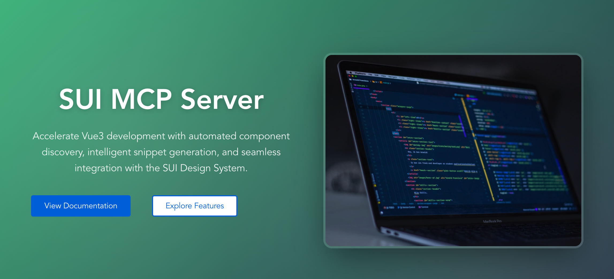

# SUI MCP Demo (Vue 3 + Vite)

<p align="center">
	
</p>

This demo app shows how you can use the SUI Model Context Protocol (MCP) server to accelerate UI development by asking an AI assistant (Claude Code) to understand existing components, generate snippets, and refactor pages.

---

## 1. Install & Run the Demo App

```bash
cd sui-mcp-demo
npm install
npm run dev
```

App runs (default) at: http://localhost:5173

---

## 2. Connect the SUI MCP Server

First, in a second terminal start (or ensure running) the SUI MCP / HTTP server from the sibling folder `sui-mcp-server`:

```bash
cd ../sui-mcp-server
npm install   # first time only
npm run dev   # starts HTTP + SSE server at http://localhost:3333
```

it will show something like this when the server is ready: `MCP server listening on http://localhost:3333` the server is ready.

### Use MCP server via Claude code
Inside Claude Code (or another MCP‑aware chat) send the bootstrap prompt so the assistant knows it can call the server:

1. Ask Claude to use the MCP server

```
you have access to the mcp server at http://localhost:3333/mcp
```
2. Let the claude know what are the available components

```
# in claude code
# test the mcp server and let the AI know the all available components

curl -X POST http://localhost:3333/mcp/initialize

OR:

curl http://localhost:3333/mcp/listComponents | jq
```

---

## 3. Using the MCP Server in Chat

Once connected you can ask for higher‑level changes. The assistant will typically:

1. List available components (`/mcp/listComponents` under the hood)
2. Fetch detailed meta for specific ones (`/mcp/getComponentMeta/:name`)
3. Generate code snippets (`/mcp/generateSnippet`)
4. Insert or refactor Vue SFCs in `src/components` or pages in `src`.

### Example Prompts

Try pasting (or adapting) these after connection:

1. Update the home page:
	> Update the home page to showcase the SUI MCP Server. use sui card, button and other components and generate a responsive card section with: (a) a headline describing what the SUI MCP server does, (b) bullet points of benefits (faster discovery, automated snippet generation, consistent imports), (c) buttons that link to documentation placeholders. Use free online placeholder images (unsplash) in the cards. Keep styling consistent with existing components if available.

2. Create a buttons gallery page:
	> Create a new page `ButtonsGallery.vue` that lists every available button component from the SUI library. For each button show: variant name, a live example instance, and the snippet used to render it. Add a short intro paragraph at the top. Route it via the app's router and add a navigation link.

3. Discover components:
	> List all registered SUI components you can see along with how many props each has. Then suggest three high‑impact UI improvements for the home page using them.

4. Generate a specific snippet:
	> Generate a Vue snippet for `SmButton` with variant="primary" size="md" and label "Get Started" wrapped in a simple flex container.

5. Preview code (if using MCP preview tool):
	> Render a preview for a card layout with three `SmButton` components in different variants.

Feel free to iterate: ask the assistant to refine accessibility, add ARIA labels, extract repeated UI into smaller components, etc.

---

## 4. Folder Layout (Demo)

| Path | Purpose |
| ---- | ------- |
| `src/main.js` | App bootstrap |
| `src/App.vue` | Root shell |
| `src/components/` | Demo components (targets for MCP modifications) |
| `src/router/` | Route definitions |
| `src/services/i18n/` | i18n scaffolding |

---

## 5. Safety / Tips

* Commit before large AI refactors so you can diff changes.
* If metadata seems stale, ensure the server `component-meta.json` was regenerated (`npm run generate-meta` in `sui-mcp-server`).
* You can stop the server with Ctrl+C and restart; the chat can reconnect using the same bootstrap prompt.
